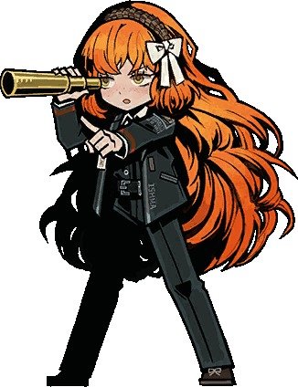

        
      
    

I'm an aspiring developer who is enthusiastic about learning new things. Currently, my main focus and interest lie in **Machine Learning**.
I have hands-on experience working on both collaborative group projects and solo endeavors.
arc raiders used on their game, it whats inspired me to learn more about machine learning. i hope these inspiration will 
continue to keep me learning with passion. My journey into machine learning was heavily inspired by the advanced reinforcement learning systems used in the game **Arc Raiders**. 
My ultimate goal is to build an equivalent AI system of my own. This vision keeps me constantly motivated, and 
I hope this passion continues to drive my learning journey every single day.It's going to be a steep learning curve and a big challenge, 
but I'm ready to take it on step-by-step and see how far I can go. 

<!--
**lTsumetai/lTsumetai** is a ✨ _special_ ✨ repository because its `README.md` (this file) appears on your GitHub profile.

Here are some ideas to get you started:

- 🔭 I’m currently working on ...
- 🌱 I’m currently learning ...
- 👯 I’m looking to collaborate on ...
- 🤔 I’m looking for help with ...
- 💬 Ask me about ...
- 📫 How to reach me: ...
- 😄 Pronouns: ...
- ⚡ Fun fact: ...
-->
