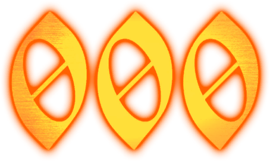
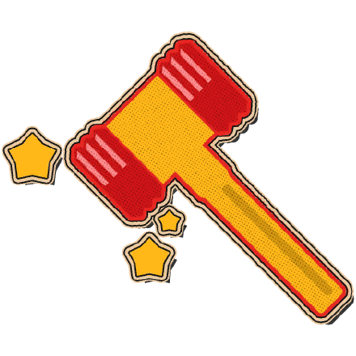

        
      
    

##  About me
I'm an **aspiring developer** who is enthusiastic about learning new things. Currently, my main focus and interest lie in **Machine Learning**, and I have hands-on experience working on both collaborative group projects and solo endeavors. I am now actively focused on building solo projects to strengthen my foundational knowledge as a newcomer to the field, I am still learning a lot every single day.

My journey into machine learning was heavily inspired by the advanced **reinforcement learning** systems used in the game **Arc Raiders**. My ultimate goal is to build an equivalent AI system of my own. 

This vision keeps me constantly motivated, and I hope this passion continues to drive my learning journey every single day. It's going to be a steep learning curve and a big challenge, but I'm ready to take it on step by step and see how far I can go.

##  Tech Stack

| Category | Technologies |
| :--- | :--- |
| **Languages & Core Data** |  &nbsp;  &nbsp;  &nbsp;  |
| **Machine Learning & NLP** |  &nbsp;  &nbsp;  &nbsp;  |
| **Data Pipelines & BI** |  &nbsp;  |
| **Data Visualization** |  &nbsp;  &nbsp;  |
| **Database & Search** |  &nbsp;  &nbsp;  &nbsp;  |
| **Infrastructure & Apps** |  &nbsp;  |

##  Connect with me

[![LinkedIn](https://img.shields.io/badge/LinkedIn-0077b5?style=for-the-badge&logo=data:image/svg+xml;base64,PHN2ZyB3aWR0aD0nMjU2JyBoZWlnaHQ9JzI1NicgeG1sbnM9J2h0dHA6Ly93d3cudzMub3JnLzIwMDAvc3ZnJyBwcmVzZXJ2ZUFzcGVjdFJhdGlvPSd4TWlkWU1pZCcgdmlld0JveD0nMCAwIDI1NiAyNTYnPjxwYXRoIGQ9J00yMTguMTIzIDIxOC4xMjdoLTM3LjkzMXYtNTkuNDAzYzAtMTQuMTY1LS4yNTMtMzIuNC0xOS43MjgtMzIuNC0xOS43NTYgMC0yMi43NzkgMTUuNDM0LTIyLjc3OSAzMS4zNjl2NjAuNDNoLTM3LjkzVjk1Ljk2N2gzNi40MTN2MTYuNjk0aC41MWEzOS45MDcgMzkuOTA3IDAgMCAxIDM1LjkyOC0xOS43MzNjMzguNDQ1IDAgNDUuNTMzIDI1LjI4OCA0NS41MzMgNTguMTg2bC0uMDE2IDY3LjAxM1pNNTYuOTU1IDc5LjI3Yy0xMi4xNTcuMDAyLTIyLjAxNC05Ljg1Mi0yMi4wMTYtMjIuMDA5LS4wMDItMTIuMTU3IDkuODUxLTIyLjAxNCAyMi4wMDgtMjIuMDE2IDEyLjE1Ny0uMDAzIDIyLjAxNCA5Ljg1MSAyMi4wMTYgMjIuMDA4QTIyLjAxMyAyMi4wMTMgMCAwIDEgNTYuOTU1IDc5LjI3bTE4Ljk2NiAxMzguODU4SDM3Ljk1Vjk1Ljk2N2gzNy45N3YxMjIuMTZaTTIzNy4wMzMuMDE4SDE4Ljg5QzguNTgtLjA5OC4xMjUgOC4xNjEtLjAwMSAxOC40NzF2MjE5LjA1M2MuMTIyIDEwLjMxNSA4LjU3NiAxOC41ODIgMTguODkgMTguNDc0aDIxOC4xNDRjMTAuMzM2LjEyOCAxOC44MjMtOC4xMzkgMTguOTY2LTE4LjQ3NFYxOC40NTRjLS4xNDctMTAuMzMtOC42MzUtMTguNTg4LTE4Ljk2Ni0xOC40NTMnIGZpbGw9JyNmZmYnLz48L3N2Zz4K)](https://linkedin.com/in/fauzimaulananugraha)

